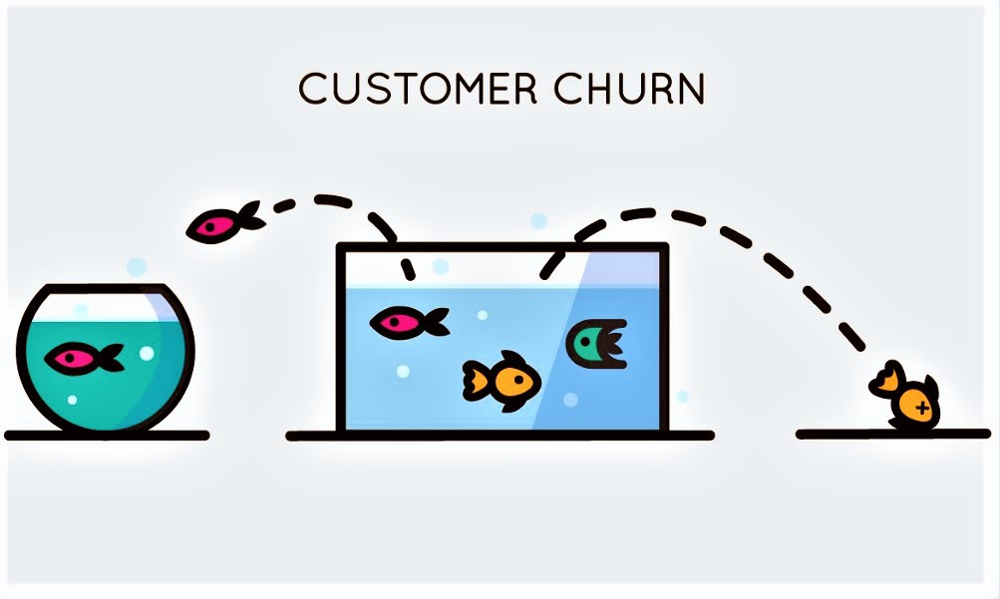

# 
Classification Project: Telco Churn 

by: Paige Rackley 

  

 * * *  
[[Project Description](#project_description)]
[[Project Planning](#planning)]
[[Data Dictionary](#dictionary)]
[[Data Acquire and Prep](#wrangle)]
[[Data Exploration](#explore)]
[[Modeling](#model)]
[[Conclusion](#conclusion)]
___

## Project Description:
  > - Document code, process (data acquistion, preparation, exploratory data analysis and statistical testing, modeling, and model evaluation), findings, and key takeaways in a Jupyter Notebook Final Report.
  > - Create modules (acquire.py, prepare.py) that make my process repeateable and easy to follow.
  > - Explore data that will help to understand the drivers of customers churning. Answer questions that arise using charts and statistical tests.
  > - Construct a model to predict customer churn using classification techniques, and make predictions for a group of customers.
  > - Refine work and processes into a Final Report that shows what work was done, my goals, what I found and my conclusions.
[[Back to top](#top)]

***
## Project Planning:
  
  
 ### Business Goals: 
 > - Find drivers for customer churn at Telco. Why are customers churning?
 > - Construct a ML classification model that accurately predicts customer churn.
 > - Deliver a report that a non-data scientist can read through and understand.

 ### Audience:
> - My target audience is for fellow Codeup Students and staff. 
  
  
 ### Deliverables:
> - A final report notebook
> - A final report notebook presentation
> - All necessary modules to make my project reproducible

### Nice to haves (With more time):
> - On your best model, a chart visualizing how it performed on test would be valuable.
        
### Initial Hypothesis: Churn is most directly associated with 4 factors: Senior citizens, electronic checks, fiber optic internet, and tech support

## Hypothesis:
  
# Question1: Is churn associated with senior citizens?
  - H0: Rate of churn is not dependent on being a senior citizen.
  - H1: Rate of churn is dependent on being a senior citizen.
  
# Question2: Is churn associated with fiber optic internet?
  - H0: Churn is not dependent on having fiber optic internet.
  - H1: Churn is dependent on having fiber optic internet.

# Question3: Is churn associated with customers who use electronic checks for payments?
  - H0: Churn is not dependent on electronic check payment type.
  - H1: Churn is dependent on electronic check payment type.
 
# Question4: Is churn associated with those who don't receive tech support?
  - H0: Churn is not dependent on if a customer receives tech support.
  - H1: Churn is dependent on if a customer receives tech support.

[[Back to top](#top)]

**

***

## Data Dictionary  
[[Back to top](#top)]

### Data Used
  
Target|Datatype|Definition|
|:-------|:--------|:----------|
| churn | 7043 non-null: object | customer churn Yes or No |

|Feature|Datatype|Definition|
|:-------|:--------|:----------|
| internet_service_type_id       | 7043 non-null: int64 |    id refering to type of internet service used |
| payment_type_id        | 7043 non-null: int64 |    id refering to type of payment used |
| contract_type_id       | 7043 non-null: int64 |    id refering to type of contract used |
| customer_id        | 7043 non-null: object |    individual customer id string |
| gender       | 7043 non-null: object |    customer male or female |
| senior_citizen        | 7043 non-null: int64 |    is customer senior |
| partner       | 7043 non-null: object |    does customer have a partner |
| dependents        | 7043 non-null: object |    does customer have dependents |
| tenure       | 7043 non-null: int64 |    length customer with company in months |
| phone_service        | 7043 non-null: object |    uses phone service Yes or No |
| multiple_lines       | 7043 non-null: object |    Yes, No, or No phone service |
| online_security        | 7043 non-null: object |    Yes, No, No internet service |
| online_backup       | 7043 non-null: object |    Yes, No, No internet service |
| device_protection        | 7043 non-null: object |    Yes, No, No internet service |
| tech_support       | 7043 non-null: object |    Yes, No, No internet service |
| streaming_tv        | 7043 non-null: object |    Yes, No, No internet service |
| streaming_movies       | 7043 non-null: object |    Yes, No, No internet service |
| paperless_billing        | 7043 non-null: object |    uses paperless billing Yes or No |
| monthly_charges       | 7043 non-null: float64 |    monthly bill amount in USD |
| total_charges        | 7043 non-null: object |    lifetime total charged to customer in USD  |
| contract_type       | 7043 non-null: object |    One Year, Two Year, Month-to-month |
| payment_type        | 7043 non-null: object |    Electronic check, Mailed check, Bank transfer (automatic), Credit card (automatic)|
| internet_service_type       | 7043 non-null: object |    Fiber optic, DSL, None |
***

## Data Acquisition and Preparation
  
 ## Acquire & Prepare
### acquire.py
Data is aquired from the company SQL database using MySQLWorkBench. Functions are stored in the acquire.py file, which allows quick access to the data. Once the aquire file is imported, it can be used each time using the data.
### prepare.py
Within the prepare.py file:
Any duplicate observations are removed
Convert the total charges column to a float value.
Changed all columns that were binary to numeric.
  - For example, columns that were either 'Yes/No to 1/0.
Stored non-binary data in a 'dummies dataframe'
Added the dummies dataframe to the original.
Assigned more readable names to columns that needed it.
Dropped duplicate columns.
  - all '_id' categories (all of these are covered in different columns that can be encoded)
Split the data into the 3 needed dataframes: train, validate, and test.
We stratify on 'churn' since this is our main target

  
[[Back to top](#top)]

]

### Takeaways from exploration:
The features tested all rejected the null, so they will be the focal points in the models. All other columns will be excluded to produce more precise results. 

***

***

## Modeling:
  
## Model
After splitting and exploring the data, we move on to modeling.  
With the train data set, try four different classification models, determining which data features and model parameters create better predictions
- Decision Tree
- Random Forest
- KNN
- Logistic Regression
Evaluate the 3 top models on the validate data set
Evaluate the best model on the test data set   
  
  
[[Back to top](#top)]

## Conclusion:
  
 ### The factors that most affect churn can be solved in a number of ways. 
#### Senior Citizens:
1. Marketing to non senior citizens.
2. Create marketing to keep senior citizens, such as discounts or promotional deals for staying.

#### Fiber Optic:
1. There could be potential issues with the fiber optic service, so performing an investigation would be insightful.

#### Electronic Checks:
1. Create incentives to switch to different payment types to potentially reduce churn.

#### Tech Support:
1. Increase tech support coverage and make tech support resources more available

#### Next steps: explore the data to find more drivers of churn and use these to refine the model. 
  
[[Back to top](#top)]
  
  
  **How to Reproduce**
- [x] Read this README.md
- [ ] Download the aquire.py and prepare.py into your working directory
- [ ] Have fun doing your own exploring, modeling, and more! 

